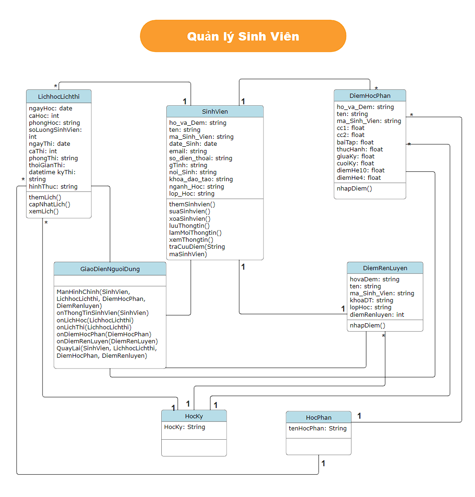

### **Ứng dụng quản lý sinh viên khoa CNTT**

## **Mục lục**
1. [Giới thiệu](#giới-thiệu)
2. [Thành viên nhóm](#thành-viên-nhóm)
3. [Mục tiêu cần đạt của dự án](#mục-tiêu-cần-đạt-của-dự-án)
4. [UML Dự Án](#uml-dự-án)
5. [Chức năng ứng dụng](#chức-năng-ứng-dụng)
   - [Nhập thông tin sinh viên](#nhập-thông-tin-sinh-viên)
   - [Nhập điểm học phần](#nhập-điểm-học-phần)
   - [Nhập điểm rèn luyện](#nhập-điểm-rèn-luyện)
   - [Cập nhật lịch học/lịch thi](#cập-nhật-lịch-họclịch-thi)
   - [Tra cứu điểm học phần/điểm rèn luyện](#tra-cứu-điểm-học-phầnđiểm-rèn-luyện)
6. [Xử lý dữ liệu](#xử-lý-dữ-liệu)
7. [Tùy chọn nâng cao](#tùy-chọn-nâng-cao)
8. [Hướng dẫn cài đặt và chạy chương trình](#hướng-dẫn-cài-đặt-và-chạy-chương-trình)
9. [Màn hình ứng dụng](#màn-hình-ứng-dụng)

---

### **Giới thiệu**
Đây là một dự án xây dựng một ứng dụng quản lý sinh viên bằng ngôn ngữ Java với giao diện JavaFX. Ứng dụng sẽ hỗ trợ các chức năng cơ bản như cập nhật thông tin sinh viên, lịch học/lịch thi, điểm học phần, điểm rèn luyện, tra cứu điểm điểm học phần/điểm rèn luyện và lưu trữ dữ liệu xuống file nhị phân.

---

### **Thành viên nhóm**
   - **Bùi Anh Quốc**: Phát triển ứng dụng toàn diện.
   - **Trần Anh Tú**: Đóng góp, kiểm thử ứng dụng.

---

### **Mục tiêu cần đạt của dự án**

1. **Giao diện**: 
   - Ứng dụng sử dụng giao diện đồ họa JavaFX.
  
2. **Chức năng**:
   - Nhập thông tin sinh viên: Thêm, sửa, xóa sinh viên; liệt kê sinh viên.
   - Cập nhật lịch học/lịch thi.
   - Nhập điểm rèn luyện và xếp loại cho sinh viên.
   - Nhập điểm học phần và xét học lực cho Sinh Viên.
   - Tra cứu điểm học phần, điểm rèn luyện.

3. **Dữ liệu**: 
   - Dữ liệu cần được lưu trữ trong các file nhị phân.
   - Dữ liệu sẽ được quản lý trong các Collection như `ArrayList`, `LinkedList`, `Map`, v.v.

4. **Tùy chọn nâng cao**:
   - Sinh viên có thể thêm các chức năng bổ sung để làm phong phú thêm ứng dụng.

---
### **UML Dự Án**
   - **UML Class Diagram**
    
   - **UML Sequence Diagram ThongTinSinhVien**
    
   - **UML Sequence Diagram LichHocLichThi**
    
   - **UML Sequence Diagram DiemHocPhan**
    
   - **UML Sequence Diagram DiemRenLuyen**
    
   - **UML Sequence Diagram Tra cứu điểm**
    
---   

### **Chức năng ứng dụng**

#### **Nhập thông tin sinh viên**
- **Thêm sinh viên**: Người dùng có thể nhập thông tin sinh viên (Mã sinh viên, Họ tên, Ngày sinh, Điểm trung bình) và lưu vào hệ thống.
- **Sửa thông tin sinh viên**: Cho phép chỉnh sửa thông tin của sinh viên đã tồn tại.
- **Xóa sinh viên**: Xóa sinh viên ra khỏi danh sách.
- **Liệt kê sinh viên**: Hiển thị danh sách sinh viên hiện có trong hệ thống.

#### **Nhập điểm học phần**
- **Nhập điểm**: Giảng viên hoặc người quản lý có thể nhập điểm cho các môn học mà sinh viên đã đăng ký.

#### **Nhập điểm rèn luyện**
- **Nhập điểm**: Giảng viên hoặc người quản lý có thể nhập điểm rèn luyện cho học học kỳ đó mà sinh viên đã đăng ký.

#### **Cập nhật lịch học/lịch thi**
- **Cập nhật**: Giảng viên hoặc người quản lý có thể Cập nhật lịch học/lịch thi cho học học kỳ mà sinh viên đã đăng ký.

#### **Tra cứu điểm học phần/điểm rèn luyện**
- **Tra cứu**: Sinh viên hoặc người dùng có thể tra cứu điểm học phần cũng như điểm rèn luyện cho học kỳ mà sinh viên đã đăng ký.

---

### **Xử lý dữ liệu**

- Dữ liệu sẽ được lưu trữ trong các file nhị phân.
- Khi làm việc với dữ liệu trong bộ nhớ, dữ liệu cần được lưu trữ trong các cấu trúc dữ liệu như `ArrayList`, `LinkedList`, hoặc `Map`.

**Các lớp liên quan:**
- **GiaoDienNguoiDung**: Lớp đại diện cho người dùng có thể quay trở lại màn hình chính sau khi đã hoàn tất một thao táo nào đó.
- **HocPhan**: Lớp đại diện cho một học phần với các thuộc tính như Mã học phần, Tên học phần, và Số tín chỉ.

---

### **Tùy chọn nâng cao**

- Có thể phát triển thêm các chức năng như:
  - Thống kê điểm trung bình của toàn bộ sinh viên.
  - Sắp xếp danh sách sinh viên theo điểm trung bình hoặc theo tên.
  - Xuất dữ liệu ra file CSV hoặc Excel.
  - Gửi email thông báo cho sinh viên khi có cập nhật về điểm số.

---

### **Hướng dẫn cài đặt và chạy chương trình**

1. **Cài đặt môi trường**:
   - Cài đặt JDK (Java Development Kit).
   - Cài đặt IDE hỗ trợ JavaFX như IntelliJ IDEA hoặc Eclipse.
   - Cài đặt thư viện JavaFX nếu chưa có sẵn.

2. **Clone repository từ GitHub**:
   https://github.com/AnhQuocs/GROUP_7-OOP-N03.git

3. **Chạy chương trình**:
   - Import project vào IDE và cấu hình JavaFX.
   - Chạy file `App.java` để khởi động ứng dụng quản lý sinh viên.

---

### **Màn hình ứng dụng**

- **Màn hình chính**:

- **Màn hình đăng nhập của dự án**:

